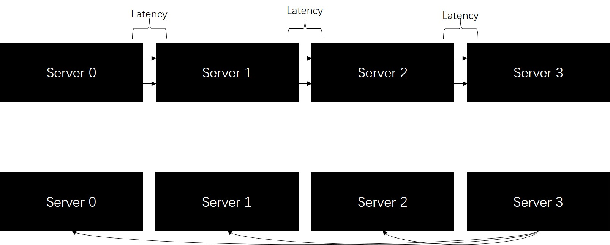
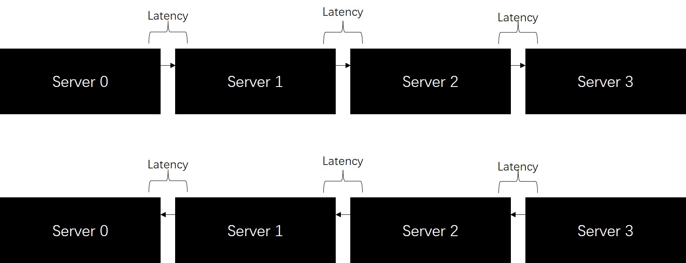
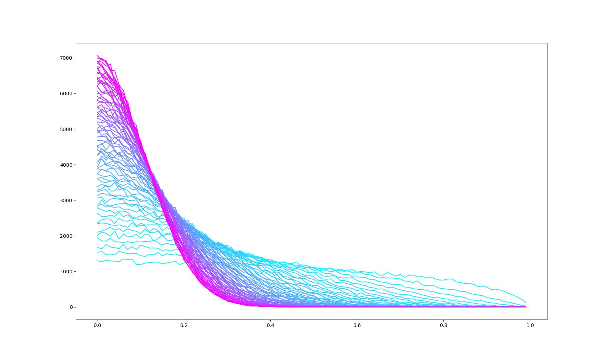

# Understanding Forward-Forward (FF)

#2023-05-05 

## Introduction

Recently, the founding father of deep learning, Geoffrey Hinton presented a novel algorithm called forward-forward method (FF) for training deep neural networks (DNN) ([presentation material](https://www.cs.toronto.edu/~hinton/FFA13.pdf)). The correspondent paper from their team was later accepted by ICLR23 ([available on arxiv.org](https://arxiv.org/abs/2210.03310)). Although the idea of FF is somewhat borrowed from [Baydin's research](https://arxiv.org/abs/2202.08587), it was their work that made this idea applicable to DNNs. 

To understand the ICLR23 paper, we first clarify the definition of FF method and derive its computational and mathematical properties. Later we show why it is potentially more computationally efficient and why it is impractical to be naively applied to DNNs. Improvement that finally makes it practical leads us to activation perturbation and local loss functions that the paper presented. 

## Definition of Naive FF Method

Naive FF Method is super simple, and can be roughly described like this: 

```pseudocode
ACQUIRE W = paramters in the model
ACQUIRE H = the objective function with the model plugged-in like \
	H(W, D) = Objective(Model(W, D.input), D.label)
ACQUIRE D = input data
FOREACH iteration: 
    DW = a randomly guessed direction
    IF stepping along DW from W makes H(W, D) decrease: 
        stepping along DW
    ELSE:
    	stepping along -DW
```

The problem is how to know if H(W, D) will increase/decrease? Here we have to compute directional derviative. Technically, directional derviative describes how the value of a function changes on a certain point when you apply a perturbation (small adjustment) on that point. 

For a $\mathbb{R}^n \to \mathbb{R}^m$ differentiable function, it can be defined as follows. 
$$
\begin{aligned}
&f:\mathbb{R}^n\to \mathbb{R}^m\\
&\frac{{\rm d}f}{{\rm d}\vec x}(x)=\lim_{h\to 0^+}\frac{f(x+h\cdot \vec x)-f(x)}{h}
\end{aligned}
$$
Where $\vec x$ is the direction of perturbation, and $h$ controls how big is the perturbation, so we can get the local direction of $f$ with given $h$ . 

From the above definition, one can view the full derivative of function $f$ as a map $\vec f$ that takes a direction $\vec x$ and a point $x$, and outputs the directional deriavative $\displaystyle\vec f(x,\vec x)=\frac{{\rm d}f}{{\rm d}\vec x}(x)$ . 

In the context of deep learning, $\vec f(x,\vec x)$ is often called **forward gradient**. Their is a function in jax (a python package) called vjp that you can use for free. 

And naturally it also has the chain rule (presented in the notation defined above)
$$
\begin{aligned}
& f:\mathbb{R}^n\to \mathbb{R}^m\\
& g:\mathbb{R}^m\to \mathbb{R}^k\\
& f\circ g:\mathbb{R}^n\to \mathbb{R}^k\\\\
& \frac{{\rm d} (f\circ g)}{{\rm d}\vec x}(x)=\frac{{\rm d}f}{{\rm d}\vec{g}(x, \vec{x})}(g(x))=\vec f(g(x),\vec g(x,\vec x))\\
\end{aligned}
$$

## Apply FF to DNNs

We implicitly mentioned a DNN as a pure function that takes the parameters $\vec w$ and the input data $x$ and returns a prediction $y$ as output. However, computing its gradient as a whole function is impractical, which involves too much symbolic computation. In practice, we have to decompose the whole DNN into several layers. 

A layer also consists of two elements, layer parameters $w$ and a pure function $f$ , which also takes the input value and the layer parameters and compute an output. For each layer, we sample a direction vector $\vec w$ for parameters, and take the input value $x$ companied by its forward gradient $\vec x$ (for the input of the first layer, we augement it with a zero vector direction). Then, we compute the output value $f(w:x)$ and a companion forward gradient $\vec f(w:x,\vec w:\vec x)$ , where operator $:$ means concatenation and we view $w$ and $x$ as flattened vectors. 

For exmaple, a linear layer with input of $m$ dimensions, weight $w[m][n]$ , and bias $b[n]$ looks like: 
$$
f(x:flat(w):b)=j\mapsto \sum_i x[i]\cdot w[i][j]+b[j]
$$
Skipping intermediate steps, we have the output forward gradient: 
$$
\vec f(x:flat(w):b,\vec x:flat(\vec w):\vec b))=j\mapsto \sum_{i}x[i]\cdot \vec w[i][j]+\vec x[i]\cdot w[i][j]+\vec b[j]
$$
where $x$ and $\vec x$ are computed from previous layers, and $\vec w$ and $\vec b$ are randomly sampled directions. 

According to the chain rule, the forward gradient $\vec h$ of the objective is the directional derivative with respect to all randomly sampled directions. Again we view the whole DNN as a function, and denote its parameters by $w$ and the sampled direction $\vec w$ , if $\vec h > 0$ (remember $\vec h$ is a scalar), then there exists $\varepsilon > 0$ that using $w-\varepsilon \vec w$ instead of $w$ will make $h$ decrease, and analogously, if $\vec h < 0$ , then there exists $\varepsilon >0$ that using $w + \varepsilon \vec w$ instead of $w$ will make $h$ decrease. 

## Computational Property

This computation process suggests a fact: the instant we know $\vec h$ , we can adjust all the parameters $w$ **in parallel**, while in backward propogation (BP) we have compute the gradient **layer by layer**. This earn FF an edge over BP in training large models. Because large models have too much parameters that a single machine cannot hold, layers are chopped into slices and distributed over several parameter servers. For FF, we only have to notify each server if $\vec h > 0$ after we finished forwarding. For BP, however, we have to wait for previous layers to finish computation. 

Illustration of latency in FF. 



Illustration of latency in BP. 



## The Curse of Dimensionality

Although FF method as computationally efficient, FF method is not good in terms of convergence. It suffers from large variance when we have many parameters. 

Intuitively, when sampling two vectors $x,y$ in $\mathbb{R}^n$ space from standard normal distribution ${\cal N}(0,I_n)$ independently, we know that the distribution of $x^Ty/(\|x\|_2\cdot \|y\|_2)$ inclines to zero when $n$ increase, which means we tend to deviate from the correct gradient direction when dimension is large. 

Let ${\cal D}(n)$ denote the distribution of $x^Ty/(\|x\|_2\cdot \|y\|_2)$ where $x$ and $y$ are from ${\cal N}(0,I_n)$. (actually $\mathcal{D}(n)$ is equivalent to the distribution of $(0,0\cdots,1)x/\|x\|_2$ , because $x$ is independent from $y$ , we will use this fact later). 

Let's do a trivial experiment here: 

Chop the interval from 0 to 1 into 1000 slices, sampling 100000 values from ${\cal D}(n)$ and we try to plot for how many samples falls in each slice with the following code and see how this distribution is affected by $n$ . 

```python
import matplotlib.pyplot as plt
import numpy as np

N = 80

for n in range(4, 80):
    x = np.random.randn(100000, n)
    y = np.random.randn(100000, n)
    z = (x * y).sum(axis=1)
    z = z / (x**2).sum(axis=1)**(1/2)
    z = z / (y**2).sum(axis=1)**(1/2)
    z = (z > 0) * z + (z < 0) * (-z)
    xaxis = [i*0.01 for i in range(100)]
    yaxis = [(((z >= i*0.01) * (z <= (i+1)*0.01))*1.0).sum() for i in range(100)]
    plt.plot(xaxis, yaxis, color=(n/80, 1-n/80, 1))

plt.show()
```

We increase the portion of red when $n$ gets larger. Here is the plot: 



Since fixing the selection of $y$ doesn't affect this distribution, we suppose $y$ is the correct gradient direction. This trivial experiement above suggests that if we sample each perturbation direction from independent normal distributions, then most of the time in FF, we are stepping towards an almost wrong direction! 

## Actually a Classical Solution

In statistical learning, problems of this kind is called big variance. Classical remedies includes adding some predefined heuristics to objective functions or cut down the number of parameters in the model. People call these bag of tricks regularizations, and apply them to deep learning. 

Here is the idea of the ICLR23 paper: we can use **local objective functions** instead of the single global one. This can be viewed from both sides: each objective functions manages a small number of parameters, and if you add the objective functions together as the global one, you add regularization term to the global objective function. A common question here is how the local objective functions is aligned to our final target. The answer is we don't even care about that. Actually most layers in DNN are redundent, and we only care about their ability to produce good enough features. Only the layers near the output layer are directly affect by the global objective. 

The question is how to select local objective functions. In this paper, they add a data augmentation module called local mixer to each layer. The local objective of the following layer suggests the layer should not be active when the input is produced by a local mixer and should be active when the input is produced by the previous layer. 

## Implementation

For implementations, see https://github.com/mpezeshki/pytorch_forward_forward. 